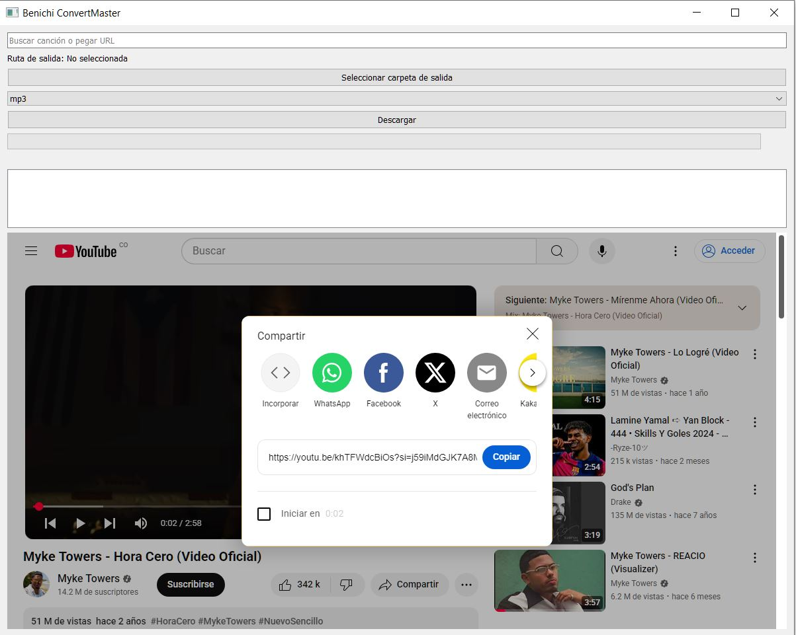
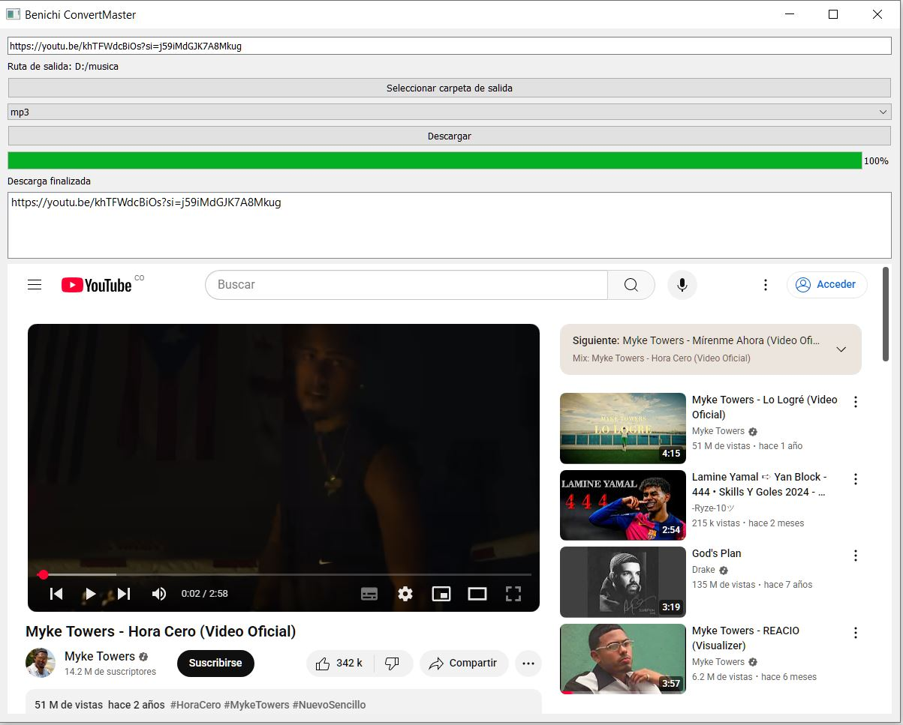
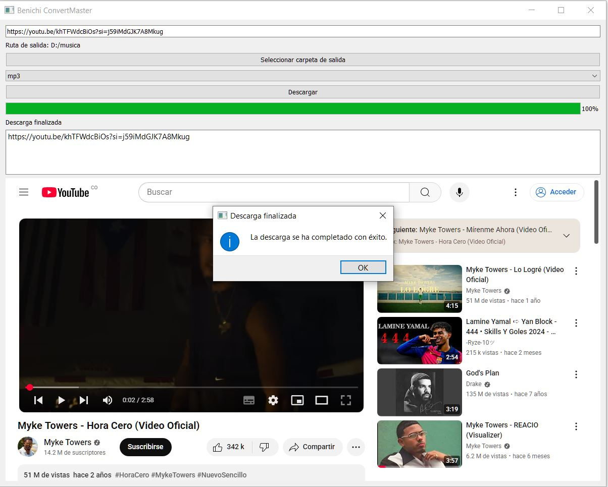
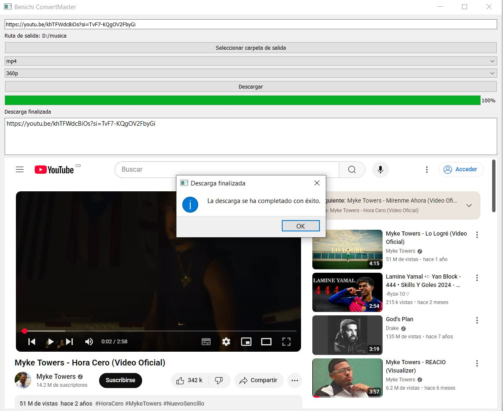
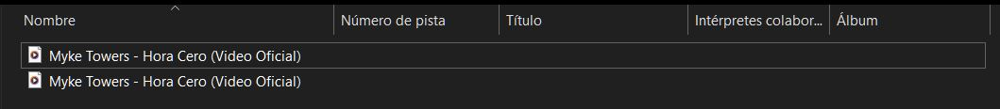

# Benichi ConvertMaster

Una aplicación de escritorio desarrollada con **Python, PyQt5 y yt\_dlp** que permite **descargar y convertir videos de YouTube** en diferentes formatos y calidades.

---

## ✨ Características Principales

* 🎵 **Descarga en MP3** (conversión de video a audio usando `ffmpeg`).
* 🎥 **Descarga en MP4** con selección de resolución (144p, 360p, 720p, etc.).
* 🌐 **Navegador embebido** con `QWebEngineView` para explorar YouTube directamente desde la aplicación.
* 📋 **Gestión de múltiples URLs**: agrega varios enlaces a la lista de descargas.
* ⚡ **Multitarea con hilos (`QThread`)** para que la interfaz no se congele durante las descargas.
* 📊 **Barra de progreso en tiempo real**.
* 🔔 **Notificaciones emergentes** (con `QMessageBox`) para informar errores, progreso y finalización.

---

## 📦 Requisitos Previos

1. **Python 3.12.6 o superior**
2. **`ffmpeg`** (colócalo en la carpeta `bin` del proyecto o agrega su ruta a las variables de entorno).

---

## ⚙️ Instalación y Configuración

1. **Clona el repositorio**

   ```bash
   git clone https://github.com/tuusuario/benichi-convertmaster.git
   cd benichi-convertmaster
   ```

2. **Crea un entorno virtual**

   ```bash
   python -m venv venv
   ```

3. **Activa el entorno virtual**

   * Windows:

     ```bash
     .\venv\Scripts\activate
     ```
   * macOS/Linux:

     ```bash
     source venv/bin/activate
     ```

4. **Instala las dependencias**

   ```bash
   pip install -r requirements.txt
   ```

---

## 🚀 Uso

1. Ejecuta la aplicación:

   ```bash
   python main.py
   ```
2. Desde la interfaz gráfica podrás:

   * Navegar en YouTube o pegar el link de un video/canción.
   * Elegir formato (MP3 o MP4).
   * Seleccionar resolución (para MP4).
   * Escoger la carpeta de destino.
   * Seguir el progreso en tiempo real.

---

## 🖼️ Capturas de Pantalla

### 1️⃣ Interfaz principal

La aplicación en ejecución con el navegador embebido y la sección para pegar el enlace del video/canción.


### 2️⃣ Descarga en MP3 completada

Un ejemplo de canción ya descargada.


### 3️⃣ Descarga en proceso (barra de progreso)

Visualización del avance de descarga en tiempo real.


### 4️⃣ Descarga en MP4

Ejemplo de un video descargándose en formato MP4.


### 5️⃣ Archivos guardados correctamente

Los archivos descargados se almacenan correctamente en la ruta elegida por el usuario.


---

## 📌 En Resumen

**Benichi ConvertMaster** es un gestor de descargas sencillo y visual que combina **YouTube, PyQt5, yt\_dlp y ffmpeg** para ofrecer descargas rápidas y conversiones a múltiples formatos. Ideal para quienes buscan una herramienta ligera y práctica.